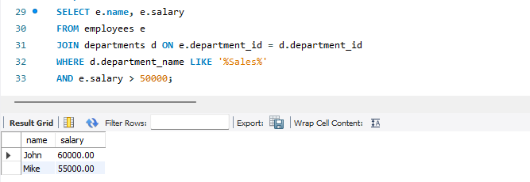
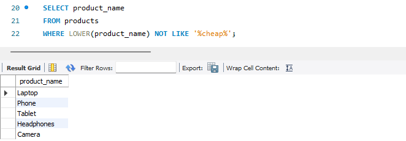

# **Module-11 (SQL) Final Exam**

### **Problem-1: SELECT and WHERE** 
> **You have a table named `students` with columns `student_id`, `name`, `age`, and `gender`. Write a query to select the names of female students who are below 25 years of age.** 

> 

### **Problem-2: ORDER BY, GROUP BY, and AGGREGATE FUNCTIONS** 
> **Consider a table named `sales` with columns `product_id`, `product_name`, `category`, and `sales_amount`. Write a query to find the total sales amount for each category, and display the results in descending order of total sales amount.**

> 

### **Problem-3: JOIN, WHERE, and LIKE** 
> **Suppose you have two tables named `employees` and `departments`, where `employees` contains columns `employee_id`, `name`, `department_id`, and `salary`, and `departments` contains columns `department_id` and `department_name`. Write a query to select the names and salaries of employees who work in the 'Sales' department and whose salaries are greater than $50000. Also, the department name should contain the word 'Sales'.**

> 

### **Problem-4: NOT, Wildcards, and LIKE** 
> **Assume you have a table named `products` with columns `product_id`, `product_name`, and `price`. Write a query to select the names of products that do not contain the word 'cheap' in their names.**

> 