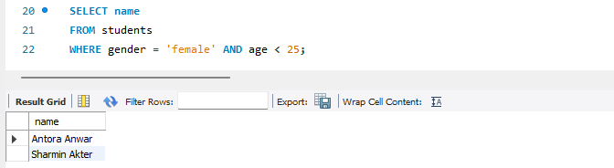
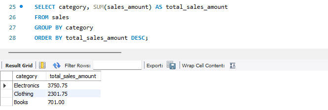

# **Module-11 (SQL) Final Exam**

### **Problem-1: SELECT and WHERE** 
> **You have a table named `students` with columns `student_id`, `name`, `age`, and `gender`. Write a query to select the names of female students who are below 25 years of age.** 

> 

### **Problem-2: ORDER BY, GROUP BY, and AGGREGATE FUNCTIONS** 
> **Consider a table named `sales` with columns `product_id`, `product_name`, `category`, and `sales_amount`. Write a query to find the total sales amount for each category, and display the results in descending order of total sales amount.**

> 