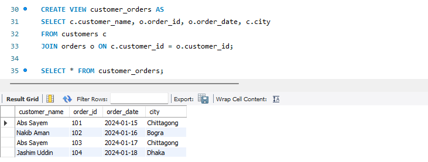
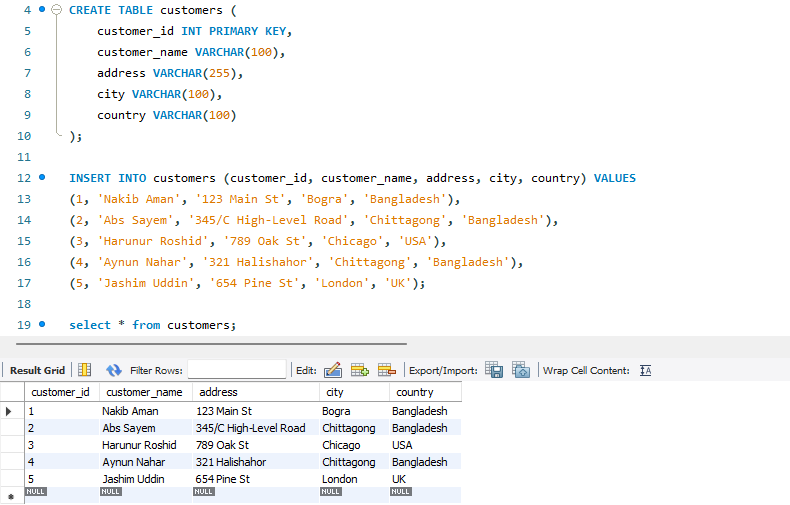
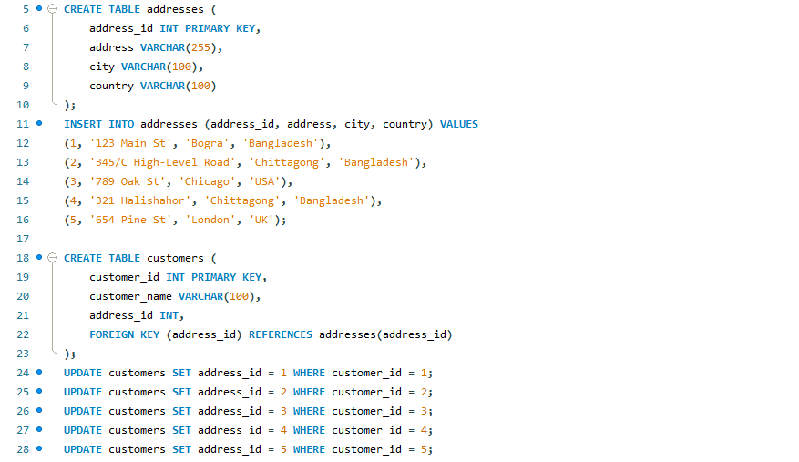
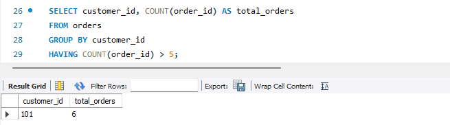

# **Module-11 (SQL) Final Exam**

### **Problem-1: SELECT and WHERE** 
> **You have a table named `students` with columns `student_id`, `name`, `age`, and `gender`. Write a query to select the names of female students who are below 25 years of age.** 

> 

### **Problem-2: ORDER BY, GROUP BY, and AGGREGATE FUNCTIONS** 
> **Consider a table named `sales` with columns `product_id`, `product_name`, `category`, and `sales_amount`. Write a query to find the total sales amount for each category, and display the results in descending order of total sales amount.**

> 

### **Problem-3: JOIN, WHERE, and LIKE** 
> **Suppose you have two tables named `employees` and `departments`, where `employees` contains columns `employee_id`, `name`, `department_id`, and `salary`, and `departments` contains columns `department_id` and `department_name`. Write a query to select the names and salaries of employees who work in the 'Sales' department and whose salaries are greater than $50000. Also, the department name should contain the word 'Sales'.**

> 

### **Problem-4: NOT, Wildcards, and LIKE** 
> **Assume you have a table named `products` with columns `product_id`, `product_name`, and `price`. Write a query to select the names of products that do not contain the word 'cheap' in their names.**

> 

### **Problem-5: Views and Joins** 
> **Consider two tables: `orders` with columns `order_id`, `customer_id`, and `order_date`, and `customers` with columns `customer_id`, `customer_name`, and `city`. Create a view named `customer_orders` that displays the customer name, order ID, and order date for each order, along with the city of the customer.**

> 

### **Problem-6: Event** 
> **Design an event in MySQL that runs every day at midnight (12 AM) and updates the `sales` table (Problem 2) by increasing the sales amount of each product by 5%.**

> 

### **Problem-7: Normalization** 
**You have a table named `customers` with columns `customer_id`, `customer_name`, `address`, `city`, and `country`. Identify any normalization issues in this table and propose a normalized schema to address them.**

>  
In this customers table, there are potential normalization issues, like- **Repeating Group:** The address, city, and country columns store information about the customer's location. Instead of storing this information directly in the customers table, it would be better to create a separate table for addresses and link it to the customers table.

> 

### **Problem-8: GROUP BY and HAVING** 
> **Consider a table named `orders` with columns `order_id`, `customer_id`, `order_date`, and `total_amount`. Write a query to find the total number of orders placed by each customer who has placed more than 5 orders.**

> 